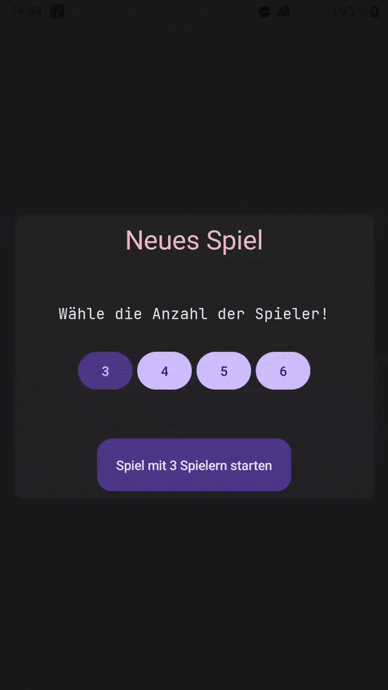
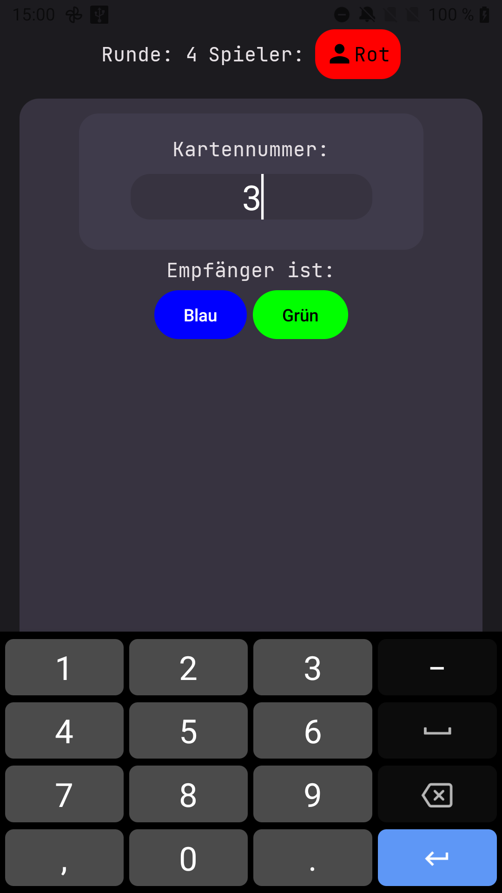
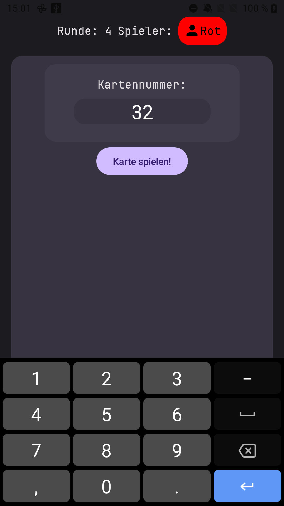
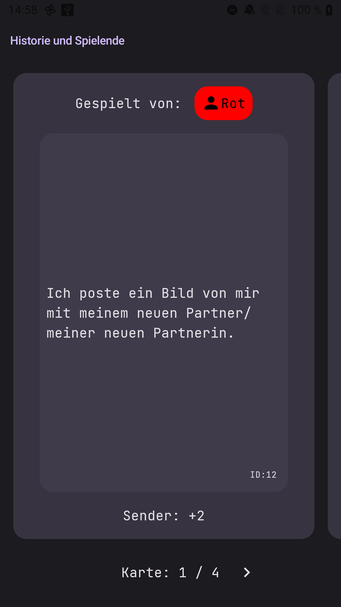
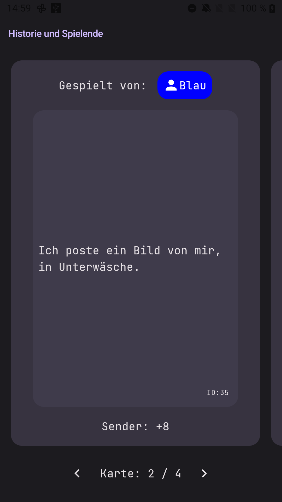
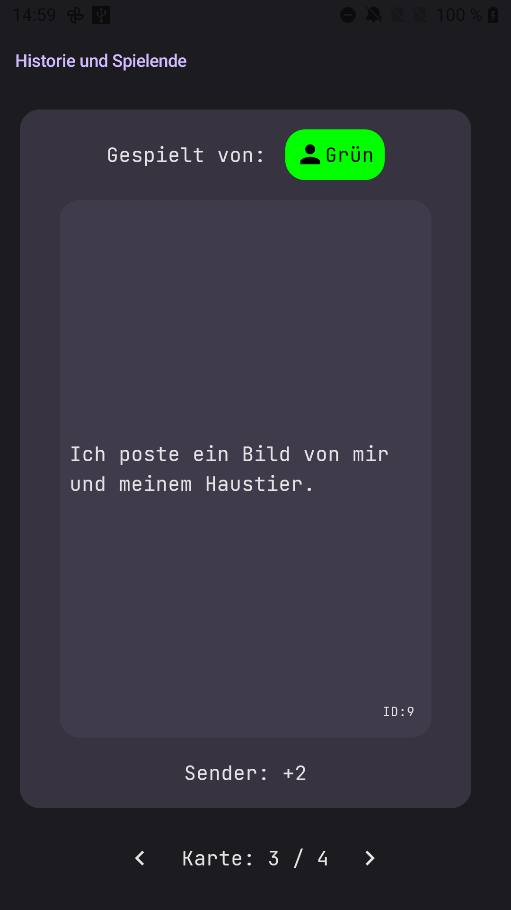
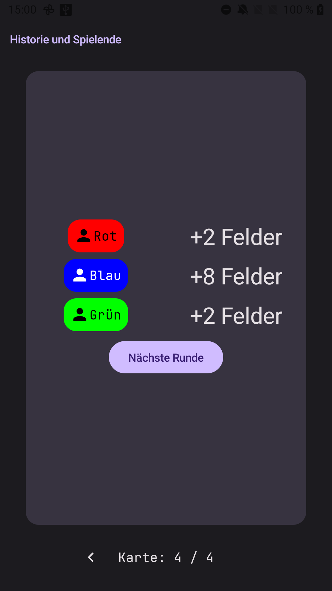

# MSc-S3-FAS-KON-Gamification
Digital Companion for a simulation game developed in the course.

## Demo Video for a view rounds

## Play Cards during the round:

## See the effects at the end of a round

